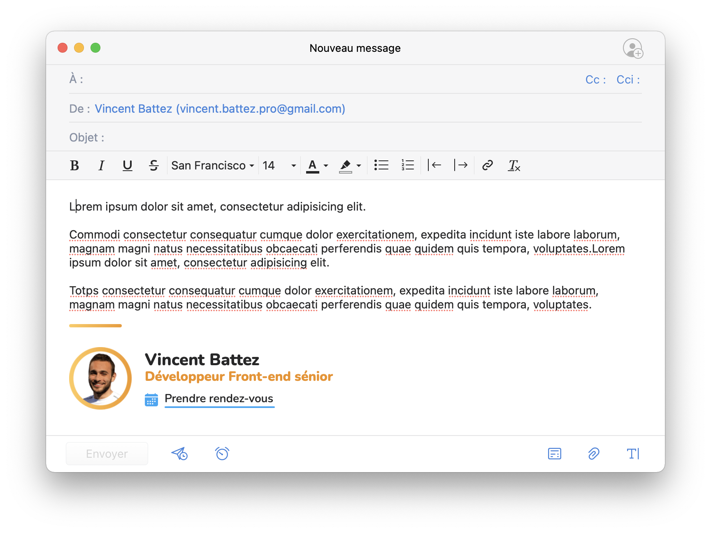
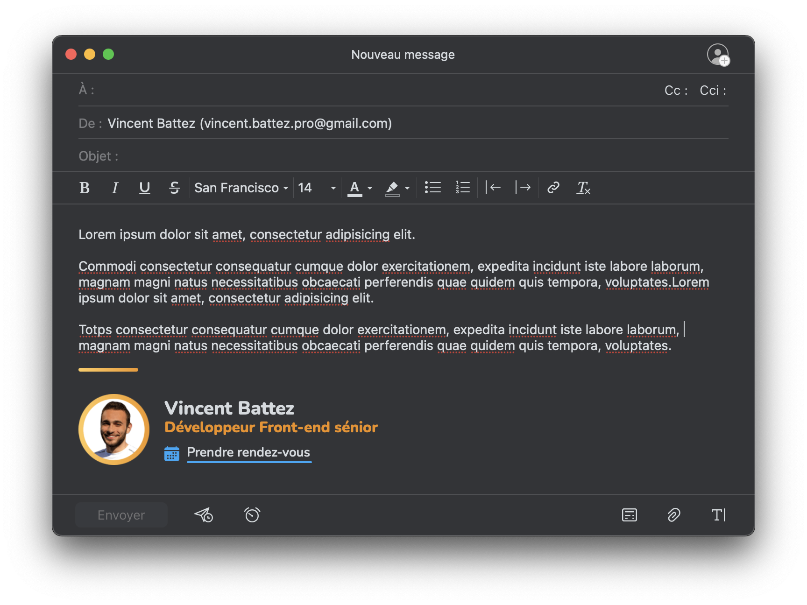

## Email Signature

> Seulement le [plain-text-signature.html](plain-text-signature.html) fonctionne (problème de darkmode sur le [index.mjml](index.mjml))

|  |  |
|:--------------------------------------:|:------------------------------------:|
